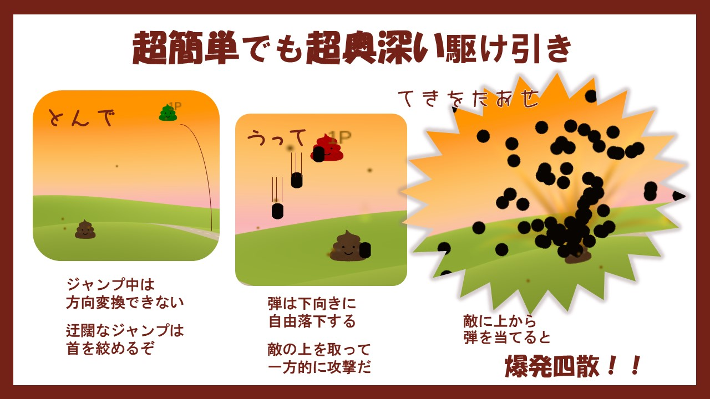
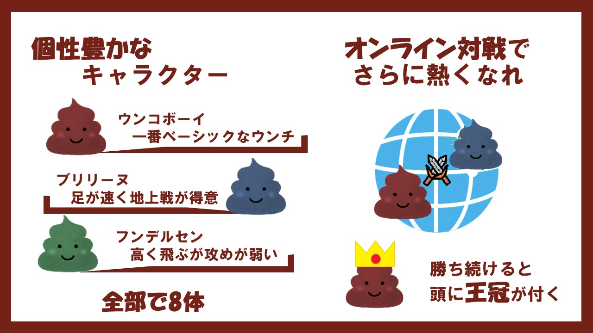
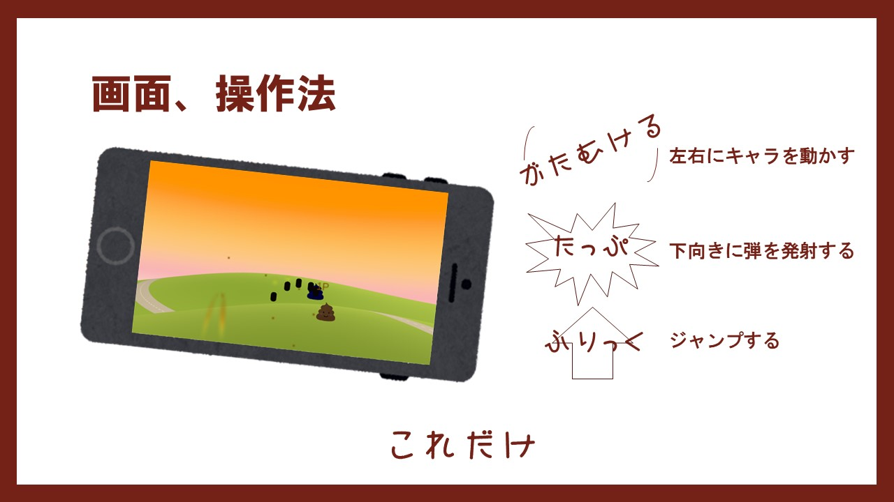

# うんちっち

Androidアプリケーション  

## 遊び方
Windowsにて遊ぶ際はReleasesに置かれておりますwintitty内のexeを実行してください。
スマートフォンにて遊ぶ際にはお手数ですが、同梱されている*Untitty.apk*を  
アンドロイド端末にダウンロードしたうえでインストールしてください  

1. タイトル  
ひとりうんち：一人プレイ、ＣＰＵと対戦します  
みんなでうんち：オンライン対戦  
おぷしょん：傾きの感度調整、難易度変更、チュートリアル  

2. キャラ選択  
斜め上、下にスライドしてキャラ選択、ダブルタップで決定  

3. バトル画面  
端末を傾けて移動、上にスライドでジャンプ、タップで真下に弾を撃つ  
このゲームは相手の上を取って弾を当てるゲームです  
  
## アピールポイント
CharaScript.cs参照  
もともとこのゲームはPC用だったのですがスマホでも操作できると思い、  
後付けで本来十字キーで操作していた機能を`Input.acceleration.x`により傾けることで操作、  
*TouchScript*によりタッチ、フリックで弾を発射、ジャンプできるようにしました。  
更にオンラインで遊べるように、*Photon*ライブラリを使用して`[PunRPC]`を付けることによって  
キャラクターの動きを同期できるようにしました。  
  
### 使用したライブラリ
Photon Network  
Touch Script 
https://github.com/OctoClo/Shaders.git
